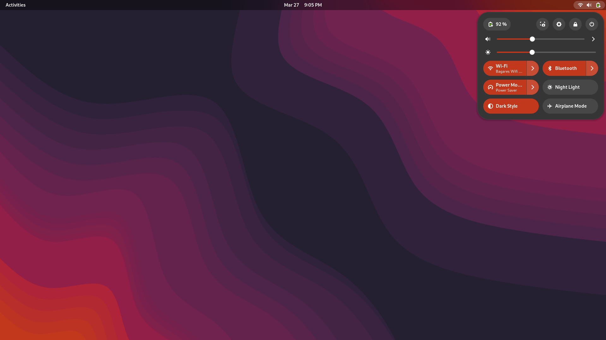
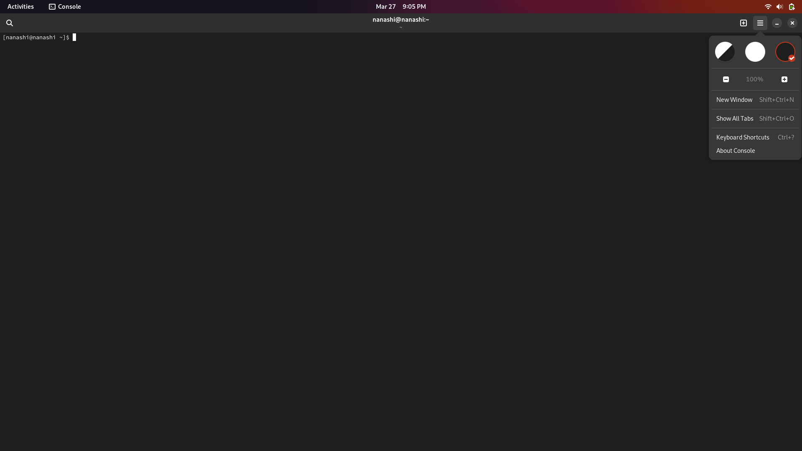

# gnome-colorer
[](https://github.com/nanashi-1/gnome-colorer/actions/workflows/eslint.yml)

`gnome-colorer` is a tool that changes the accent color of the GNOME shell, GTK3, and GTK4.

## Screenshots





## Dependencies

To use gnome-colorer, you need to have the following dependencies installed:

    typescript: a superset of JavaScript that adds static type definitions.
    ts-node: a TypeScript execution environment for node.
    @types/node: TypeScript definitions for Node.js.

You can install these dependencies using npm:

```sh
npm install --save-dev typescript ts-node @types/node
```

## Usage

To change the accent color of your GNOME shell and GTK theme, you can use the install.sh script:

```sh
./install.sh -c red # Change the accent color to red
```

You can also use hexadecimal color codes:

```sh
./install.sh -c '#ff5733'
```

## License

This software is licensed under the GNU General Public License v3.0 (GPL-3.0). This means that you are free to use, modify, and distribute this software under the terms of the license.

The GPL-3.0 is a widely used open-source license that ensures that the software remains free and open. It requires that any modifications made to the software are also licensed under the GPL-3.0, and that the source code is made available to anyone who receives a copy of the software.

By using this software, you agree to be bound by the terms of the GPL-3.0. If you do not agree to these terms, you may not use, modify, or distribute this software.
